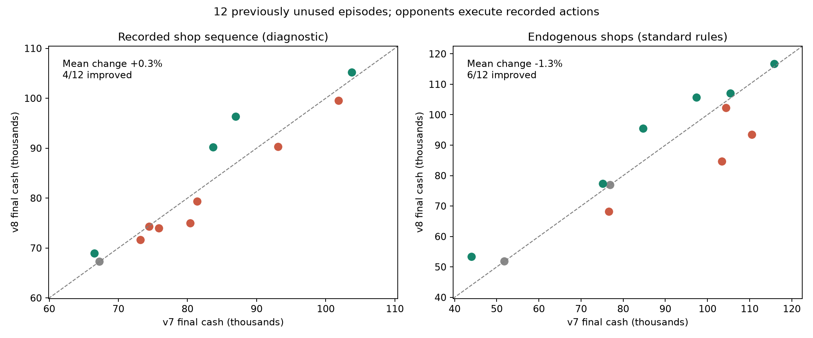

# v8 改善実験と未使用試合での検証

事前に定めた両条件の平均収益改善を満たさなかったため、v7 を既定版に維持する。v8 は評価済み候補として保存する。 対象は Majkel1337 / submission 56216119。完全再現には引き続き未達。

**変更点**

家畜の購入判断に、現在観測できる農場・倉庫・作業者の所持数の合計が増えた履歴を加えた。逃げた家畜で現在数が減っても、以前と同じ目標数まで自動的に買い戻さず、累積の取得数と目標の差までに抑える。将来の目標が増えれば追加購入できる。配置・運搬は取得として数えず、購入注文が失敗した場合も取得済みとはみなさない。同じターンに取得と損失が相殺される場合には純増分だけを数えるため、厳密な購入台帳ではない。

履歴はプレイヤーごとに分離し、試合開始や観測の不連続で初期化する。プロセスが再起動した場合も現在数から再開できるが、それ以前の損失履歴は失われる。学習済み重み・特徴量・50 試合の学習データは v7 と同一。採用した設定は `animal_purchase_cap=true`、その他の改善候補は無効。

**開発用6試合での選択**

| 候補 | 平均資金・店舗順固定 | 平均資金・通常ルール |
|---|---:|---:|
| v7 | 81,122 | 80,742 |
| slack4 | 76,298 | 未評価 |
| soft2 | 75,294 | 未評価 |
| purchase_cap | 84,497 | 84,021 |
| care2 | 83,385 | 76,314 |
| cap_care2 | 83,476 | 82,644 |

`slack4` は作付け目標に4株の余裕を加える案、`soft2` は目標超過を禁止せず評価値を下げる案。植え付け一致率は上がったが、自律実行の平均収益が下がったため棄却した。`care2` は枯死・逃走の期限が迫る給餌・水やりの優先度を上げる案、`cap_care2` はそれと購入抑制を組み合わせた案。両条件で平均収益が最大だった `purchase_cap` を選んだ。

開発の行動一致は3ターンに1回、最終評価は全ターン。開発の絶対値を最終評価と直接比較しない。購入履歴も間引き観測では再初期化されるため、市場への影響の判定には連続した自律実行と最終評価を用いる。

**未使用12試合の比較**

以前に解析した72試合を除き、公開対戦の時系列を12層に分け固定乱数で各1試合を選んだ。候補選択前に manifest を固定し、候補のコード・重みを凍結した後に評価を開始した。v7 は保存済みの元コードを読み込んだ。評価を見てから係数を変えていない。

| 条件 | v7 平均資金 | v8 平均資金 | 増減 | 改善した試合 | 平均差の95%区間 |
|---|---:|---:|---:|---:|---:|
| 店舗順固定 | 82,395 | 82,644 | +0.30% | 4/12 | -1,823 〜 +2,638 |
| 通常ルール | 87,214 | 86,046 | -1.34% | 6/12 | -6,477 〜 +3,677 |

95%区間は試合単位の対応付きブートストラップ20,000回による参考値。12試合の小標本で、同一投稿の対戦同士にも関連がある。区間が0を含む場合、平均の改善だけで安定した優位を証明したとは扱わない。

作業者行動の完全一致は v7 **73.73%** → v8 **73.73%**（v8: 63,783 / 86,509）。市場注文リスト全体の一致は **25.08%** → **25.08%**。収益の改善と元 agent の厳密な行動再現は別の指標である。

店舗順固定では、1試合平均の家畜購入費が 9,217 → 7,750、逃走数が 12.92 → 10.33 に減った。一方、売上は 109,446 → 108,046 に下がった。支出削減が生産機会も減らすため、単純な購入抑制だけでは安定した改善にならなかった。次の検討では、失った個体の買い直しを一律に止めず、残り期間の生産額と給餌・作業の余力を合わせて判断する必要がある。

| episode | 店舗順固定 v7 | 店舗順固定 v8 | 通常 v7 | 通常 v8 |
|---|---:|---:|---:|---:|
| 108737476 | 66,552 | 68,911 | 51,818 | 51,818 |
| 108763300 | 81,424 | 79,318 | 104,425 | 102,220 |
| 108924601 | 93,124 | 90,267 | 76,918 | 76,918 |
| 109182060 | 74,473 | 74,279 | 103,452 | 84,635 |
| 109345915 | 67,271 | 67,271 | 75,192 | 77,308 |
| 109583885 | 86,993 | 96,314 | 115,868 | 116,675 |
| 109910434 | 80,420 | 74,959 | 97,419 | 105,643 |
| 110199768 | 75,881 | 73,948 | 105,471 | 106,987 |
| 110338107 | 101,875 | 99,505 | 110,560 | 93,429 |
| 110470026 | 103,790 | 105,172 | 76,637 | 68,147 |
| 110735210 | 73,213 | 71,612 | 84,761 | 95,443 |
| 110948948 | 83,729 | 90,173 | 44,041 | 53,324 |

**指定試合と評価の限界**

指定された開発試合 111105944 では、店舗順固定で **74,514 → 81,898**、通常ルールで **71,293 → 66,818**。本家の記録資金は96,230。指定試合の通常ルールでは悪化しており、全試合が改善したわけではない。

相手は各試合に記録された行動列を実行する。非公開の元 agent を実行した結果でも、Leaderboard の勝率・順位推定でもない。通常ルールでは農場の変化に伴う乱数消費によって後続の店舗構成も変わる。店舗順固定はその影響を取り除く診断で、将来の店舗情報を agent に渡さない。候補の効用はこの評価条件の範囲に限られる。

**再現に必要なファイル**

- [未採用の v8 実装](baselines/v8-candidate/policy.py) / [v8 候補アーカイブ](baselines/v8-candidate/submission.tar.gz)。既定の [submission.tar.gz](submission.tar.gz) は v7 を維持。
- [候補固定時のハッシュ](reports/improvement/candidate-freeze.json) / [選定した12試合](v8-validation-manifest.json)
- [集計JSON](reports/improvement/summary.json) / [開発・最終評価の生の計測結果](reports/improvement/)
- [v7 の記録](baselines/v7/REPRODUCTION_REPORT.ja.md) / [v7 の実装](baselines/v7/policy.py)
- `compare_variants.py` と `v8-comparison-variants.json` で同じ対応付き比較を再実行できる。通常ルールは `--town endogenous --skip-teacher`、店舗固定と全ターン一致は `--stride 1` を指定する。

候補の動作テスト9件が通過。NumPy版と高速評価版は指定試合の全719手が一致した。未使用12試合の元リプレイも全8,628遷移を公式エンジンで再現できた。新しい seed 20260921 の候補同士の自律対戦は両席とも完走し、最終資金は128,970対119,752。これらは動作検証であり、競技上の優位を示すものではない。
