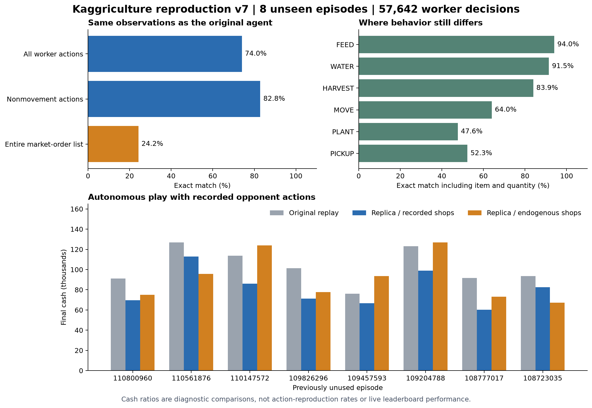

# 再現実装と検証記録

本書は **v7 の検証記録**。今回の改善実験と v7/v8 の比較は [改善報告](IMPROVEMENT_REPORT.ja.md)、v7 固定時の情報は [保存済み FREEZE.json](baselines/v7/FREEZE.json) を参照。

対象：Majkel1337 / submission **56216119**。指定 episode：**111105944**。実装：**v7**。固定時刻：`2026-09-20T06:59:03.773150+00:00`。

公開リプレイから、未知の観測にも行動を返せる近似 agent を実装した。**完全再現には未達**。元の非公開プログラムの内部構造、探索法、言語、係数は同定できていない。この実装の勾配ブースティングや仕事割り当て処理は、観測された振る舞いを再現するために今回構築したものである。

**到達点**

- 未使用の最終評価 8 試合、全 **5,752 意思決定**を対象に、作業者の完全な行動一致率は **74.00%**（42,654 / 57,642）。
- 移動を除く作業の一致率は **82.85%**。市場注文リスト全体の完全一致率は **24.24%**。注文の順序・数量も一致条件に含む。
- 最初から自律実行した場合、元試合に対する最終資金比は、通常ルールで平均 **90.12%**、店舗順を元試合に固定した診断で平均 **79.18%**。この比率は行動の再現率でも、本家との対戦勝率でもない。
- 配布する NumPy 推論器は、指定試合で高速な scikit-learn 推論器と **全 719 手が一致**。アーカイブだけを展開した隔離プロセスでも読み込みと行動の一致を確認した。

**評価対象の分離**

| 用途 | 試合数 | 扱い |
|---|---:|---|
| 学習 | 50 | 初期 18 試合と追加 32 試合。作業・移動・数量・計画・売却の学習に使用 |
| 開発 | 6 | 指定試合を含む。候補選択、修正、閾値の判断に使用 |
| 一次評価 | 8 | 数量予測版の自律運転の破綻を検出。以後、未使用評価とは呼ばない |
| 最終評価 | 8 | 修正版の固定後に評価。上記 64 試合とは重複なし |

最終評価の試合は、残る公開対戦を時系列の 8 層に分けて各層から固定乱数で 1 件選んだ。最良の試合だけを選んではいない。標本数は 8 件であり、相手の種類や店舗構成全体を十分に代表する保証はない。

試合 ID、選定条件、固定した実装・重みの SHA-256 は [v7 の FREEZE.json](baselines/v7/FREEZE.json) と各 manifest に記録した。学習途中の開発指標は間引き観測で計測したため、最終評価の全ターン集計と直接の増減比較はしない。

**評価条件の意味**

1. **行動一致率**：本家が実際に見た観測を毎回入力し、その場で生成した行動と記録行動を比較する。前の予測の誤りは次の盤面に引き継がない。移動先を選び直す違い、運搬量の違い、冗長な仕事を避ける違いも不一致になる。
2. **通常の自律実行**：初期状態だけを元試合から取り、その後の自分の観測と行動は閉ループで更新する。相手は元試合の記録行動列を実行する。相手の非公開 agent は取得・実行していない。
3. **店舗順固定の診断**：2 と同じだが、その時点で公開される店舗名だけを元試合どおりに置き換える。自分の farm、inventory、market はそのまま進める。将来の店は agent に入力しない。これは公式ルールへの介入を含む診断であり、通常の競技結果とは分ける。

同じ seed でも、農場の空きマス数が変わると `_spawn_weeds` が消費する乱数の個数が変わり、後続の店舗抽選も変わる。したがって、通常の自律実行で元の資金と比べる際には、行動の違いに加えて需要の違いも混ざる。これは [公式エンジン](https://github.com/Kaggle/kaggle-environments/blob/master/kaggle_environments/envs/kaggriculture/kaggriculture.py) の日末更新順による。

記録された相手の行動は、変化した相場や店舗を見て再計画しない。固定店舗の条件でも本家の非公開 agent との実対戦にはならず、Leaderboard の順位やレートは推定していない。

**未使用 8 試合の全結果**

| episode | 作業者行動一致 | 本家の記録資金 | 自律・通常ルール | 自律・店舗順固定 |
|---|---:|---:|---:|---:|
| 110800960 | 73.21% | 91,098 | 75,113 | 69,644 |
| 110561876 | 75.47% | 126,827 | 95,769 | 112,752 |
| 110147572 | 73.12% | 113,783 | 123,831 | 86,038 |
| 109826296 | 74.72% | 101,222 | 77,580 | 71,242 |
| 109457593 | 73.89% | 76,074 | 93,480 | 66,678 |
| 109204788 | 75.31% | 123,071 | 126,727 | 98,799 |
| 108777017 | 70.72% | 91,561 | 73,087 | 60,298 |
| 108723035 | 75.52% | 93,497 | 67,192 | 82,597 |

通常ルールの資金比の中央値は 81.14%、範囲は 71.87%〜122.88%。店舗順固定では中央値 78.36%、範囲 65.86%〜88.90%。100% を超えても、元 agent の行動をより正確に再現したことにはならない。

**行動別の一致**

| 元の操作 | 完全一致 / 件数 | 一致率 |
|---|---:|---:|
| WATER | 10,290 / 11,247 | 91.49% |
| NORTH | 5,026 / 8,846 | 56.82% |
| WEST | 5,219 / 7,558 | 69.05% |
| EAST | 3,740 / 5,351 | 69.89% |
| SOUTH | 3,339 / 5,312 | 62.86% |
| HARVEST | 3,383 / 4,030 | 83.95% |
| COLLECT_FERTILIZER | 2,354 / 2,882 | 81.68% |
| CARE | 2,198 / 2,491 | 88.24% |
| FEED | 2,256 / 2,399 | 94.04% |
| PLANT | 1,102 / 2,313 | 47.64% |
| PICKUP | 805 / 1,540 | 52.27% |
| FERTILIZE | 1,020 / 1,268 | 80.44% |
| PLACE | 832 / 908 | 91.63% |
| DROP | 624 / 636 | 98.11% |
| PASS | 282 / 440 | 64.09% |
| DIG | 56 / 291 | 19.24% |
| BUILD_PASTURE | 116 / 118 | 98.31% |
| BUILD_COOP | 12 / 12 | 100.00% |

移動方向、運搬先、餌を取りに戻る判断は、現在地の作業そのものより難しい。市場の部分一致と注文リスト全体の一致も別の指標である。

**指定された試合**

本家の記録資金は **96,230**。修正版の自律実行は、通常ルールで **71,293**、店舗順固定で **74,514**。指定試合は開発に使ったため、未使用評価の集計には含めない。

店舗順固定での会計は `3,000 + 107,006 - 35,492 = 74,514`。自律試行の収支を実際の約定から計測し、最終資金と一致することを検算した。詳しい商品別収支、収穫量、作物の枯死、家畜の逃亡、日末の在庫あふれは JSON に収録した。

**途中で棄却した候補も記録する**

売却数量を直接予測する候補は、開発用の売却機会で数量完全一致が 83.6% と高く、一次評価でも作業者行動は 73.74% 一致した。しかし自律実行では初期の換金が足りず、種代が不足して成長が止まった。一次評価 8 試合の平均資金は **4,143** に落ちた。

元の開発用指定試合でも同じ資金不足を再現し、売却割合を予測するモデルに戻した。このモデルの開発用数量誤差は 0.615 個、数量完全一致は 68.2%。最終版の採用根拠は、一手の一致度と自律運転の両方を満たすこととした。一次評価 8 試合は修正判断に関与したので除外し、別の未使用 8 試合を確保して再評価した。棄却候補の JSON も `reports/pilot-v6-*` に保存した。

**別 seed と適応する相手**

| seed | 自分の席 | 相手 | 自分の資金 | 相手の資金 |
|---|---:|---|---:|---:|
| 314159 | 0 | starter | 126,944 | 3,566 |
| 271828 | 1 | starter | 131,846 | 3,446 |
| 20260920 | 0 | self | 88,871 | 92,519 |

starter は公式の簡単な agent、self は同じ再現 agent。これらは新しい展開でも 719 手を完走することと、両席で機能することの確認であり、首位級の相手に対する強さの証明ではない。

**実行と検証**

- 公式環境 1.32.7 による元リプレイの再実行：**72 試合、51,768 遷移**で両者の公開 farm、各自の非公開 inventory、market、town、day、hour が一致。
- 配布用推論器：指定試合の平均 0.182 秒 / 手、95 パーセンタイル 0.300 秒、最大 0.445 秒。ローカル実測であり、Kaggle の実行環境での時間は未検証。
- 入口、観測非破壊、特徴の有限性、最終日の収穫・帰還期限、アーカイブ単体の読み込みを含む 7 テストが成功。
- 高速版と配布版の全行動ハッシュ：`ca665eb584a8a9fb42be7f62ae4eea270a9b8972ace596af445ac5b7a94a09dc`。
- Kaggle への提出は行っていない。

**残る差**

本家と異なる状態へ進んだ後の作業優先度と資金配分に、誤差が積み上がる。日単位の作付け・家畜目標は観測から学習した近似値で、元 agent の投資評価式ではない。次に改善するなら、最優先は複数人の移動・運搬・収穫をまとめて計画する処理と、種・餌・雇用に必要な資金を売却判断と一緒に扱う処理になる。

75 マスへの拡張や雇用人数は観測標本の傾向を規則化している。重複作業、種不足の一括無効化、最終日の持ち帰れない収穫は制約で避けるため、本家の無効手まで逐語的に模倣する設計ではない。未知のルール設定や将来バージョンへの追従は検証していない。

**成果物と出典**

- [使い方・再学習手順](README.ja.md)
- [評価の集計 JSON](reports/summary.json) / [全試合の行動一致](reports/final-teacher.json)
- [通常ルールの自律実行](reports/final-rollout-endogenous.json) / [店舗順固定の診断](reports/final-rollout-recorded.json)
- [元の振る舞いを詳しく解析した報告](REVERSE_ENGINEERING.ja.md)
- [対象 Leaderboard と指定 episode](https://www.kaggle.com/competitions/kaggriculture/leaderboard?submissionId=56216119&episodeId=111105944)
- [指定試合の公開リプレイ](https://www.kaggleusercontent.com/episodes/111105944.json)
- [公式ルール](https://github.com/Kaggle/kaggle-environments/blob/master/kaggle_environments/envs/kaggriculture/README.md)
- [公式 Python agent 読み込み処理](https://github.com/Kaggle/kaggle-environments/blob/master/kaggle_environments/agent.py)
