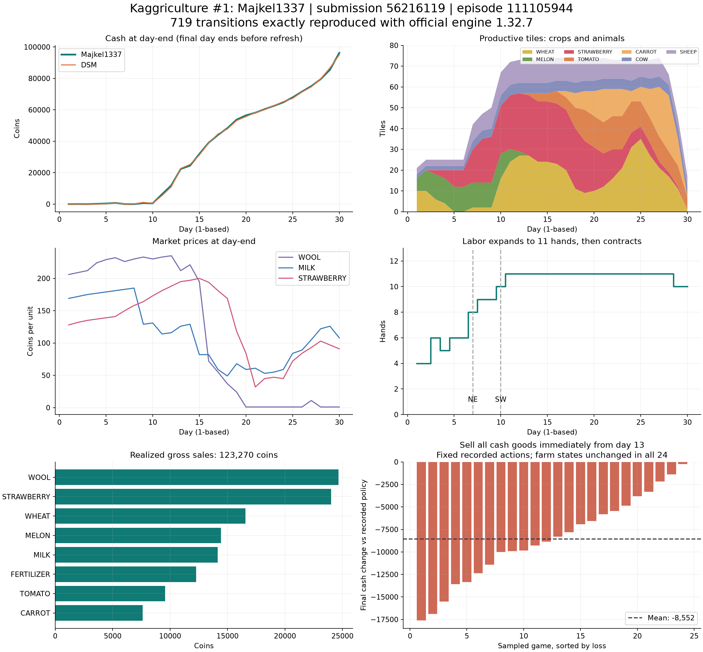

Kaggriculture 首位 Majkel1337 — 公開リプレイによる動作解析

調査日：2026-09-20。Leaderboard の保存時刻：14:40:55 JST。
対象：team 16718819 / submission 56216119。指定試合：episode 111105944。

観測した首位 agent は、**序盤のほぼ共通した投資手順、店の需要に応じた生産品目の変更、収穫時期に合わせた施肥、労働者の巡回、相場を見ながらの分割売却**を組み合わせている。特に売却処理の寄与は、農場の動きを固定した再実験で測定できた。13 日目以降の換金用商品を即時全量売却へ変更すると、24 試合すべてで最終資金が減り、平均減少額は 8,552 コインだった。

これは公開された行動からの再構成であり、競技者の非公開ソースコードを復元したという意味ではない。探索手法、学習の有無、正確な評価関数・係数は、この観測だけでは識別できない。



**調査の根拠と範囲**

Leaderboard の保存データでは Majkel1337 が 1 位、表示スコア 3275.5。2 位は DSM、3183.5。対象提出の公開日時は 2026-09-13 23:03:27 UTC。

586 件の対戦メタデータを取得した。内訳は公開対戦 585 件と提出時検証 1 件。公開対戦の成績は **439 勝 146 敗、勝率 75.04%**。最近 100 件は 84 勝 16 敗、最近 20 件は 13 勝 7 敗。現在の DSM 提出 56361903 との 17 試合は 10 勝 7 敗。組み合わせが適応的に選ばれるリーグの実績なので、無作為な相手に対する勝率や将来の勝率を表すものではない。

全行動を解析したのは 24 試合。最近の 8 試合、時系列の異なる試合、最高・最低資金、大差の勝敗、異なる対戦相手を選んだ。23 件が公開対戦、1 件が提出時の自己対戦検証。相手チームは自己対戦を含めて 13 種類。選択基準を sample-manifest.json に保存している。無作為抽出ではない。

各リプレイに記載された公式環境のバージョンは 1.32.7。PyPI の同バージョンの wheel を取得し、公開された SHA-256 と一致を確認して、その中の kaggriculture.py を使った。取得時点の GitHub master の当該ファイルともバイト単位で一致した。

**24 × 719 = 17,256 回の状態遷移を再実行し、両者の農場、個人在庫、市場、町、日付・時刻が記録とすべて一致した。** 市場の単品約定を計測し、各試合・各プレイヤーで「初期資金 + 実売上 − 実費用 = 最終報酬」も一致した。対象側だけで延べ 172,515 件の農夫・労働者行動を計測した。

重要な時間の定義：本文の「1 日目」は observation.day = 0。`t` は意思決定前の observation.step。`steps[t+1].action` が `t` で選択した行動になる。720 状態のリプレイに実行された意思決定は 719 回、最後は `t=718`。30 日目の通常の日末処理は来ない。この区別は最終日の荷下ろしと売却に直結する。

**序盤：現金をほぼ使い切る共通の投資手順**

最初の 2 手は 24 試合すべてで完全に一致した。

```python
# t = 0
{
    "farmer": ["PASS"],
    "hands": [],
    "market": [["BUY_ANIMAL", "COW", 1], ["BUY_PRODUCT", "WHEAT", 5]]
}
# t = 1
{
    "farmer": ["PICKUP", "COW", 1],
    "hands": [],
    "market": [
        ["SELL", "WHEAT", 1],
        ["HIRE"], ["HIRE"], ["HIRE"], ["HIRE"],
        ["BUY_ANIMAL", "COW", 1], ["BUY_ANIMAL", "SHEEP", 3]
    ]
}
```

この時点で牛 2 頭、羊 3 頭を調達し、農夫に加えて 4 人の労働者を確保する。牛を農夫が運び、労働者がほかの家畜を搬送する。指定試合の初日の実配置は次のとおり。座標は `(x,y)`、左上が `(0,0)`。

| 家畜 | 配置 |
|---|---|
| 牛 2 頭 | (4,4)、(4,2) |
| 羊 3 頭 | (3,4)、(4,3)、(2,4) |

倉庫に近い内側へ家畜を置き、外側へメロンや小麦を植えている。家畜には飼料の運搬・給餌・世話・肥料回収・収穫が繰り返し必要なので、この配置は往復距離を減らす構成と解釈できる。

指定試合の初日終了時は、**牛 2、羊 3、メロン 6、小麦 10、残金 5**。初日の資金は次のように完全に説明できる。

```text
開始資金                              3,000
小麦の売却収入                          +112
牛 2 頭                                -800
羊 3 頭                              -1,500
購入した小麦 8 個                      -220
メロン種 6 個                          -480
小麦種 10 個                           -100
労働者 4 人                              -7
残金                                      5
```

序盤から潤沢な予備資金を確保する方針ではなく、成長資産に大きく振り向けている。2 日目・3 日目にメロンを追加し、指定試合では合計 12 株になる。調査 24 試合では、メロン種の購入は 22 試合で 12 個、残る 2 試合は 10 個と 13 個。状況によるずれはあるが、最初のまとまった売上を作る設計は非常に安定している。

ただし、共通しているのは最初の 2 手と大枠であり、初日の全行動が固定ではない。初日の小麦が 8〜10 株など、相手の市場操作と資金条件の違いに応じた変化がある。

**拡大：羊の初回収穫を土地と次の生産に回す**

指定試合では、羊毛の初回売却が始まる 7 日目に NE を買い、10 日目に SW を買う。

| イベント | 意思決定 t | 日・その日の手数 | 実支出 |
|---|---:|---|---:|
| NE を購入 | 149 | 7 日目・6 手目 | 1,000 |
| SW の購入を試行、資金不足 | 219 | 10 日目・4 手目 | 0 |
| 羊毛売却後に SW を購入 | 221 | 10 日目・6 手目 | 2,000 |

`t=219` の観測時の現金は 271。`t=221` では観測時 1,202 に加えて同じターンの羊毛売却を先に実行し、土地購入を成立させている。行動列に `BUY_LAND` が 3 回あっても、購入できた土地は 2 区画である。指示数だけを数える解析では誤る。

24 試合すべてで最終的な購入は NE・SW の 2 区画、計 75 マス。SE は買っていない。NE 購入は 23 試合で `t=149`、1 試合だけ `t=169`。SW は `t=217〜224`。資金が潤沢になる後半にも SE は買わない。

この事実は「75 マス程度を運用上限に置く方針」と強く整合する。ただし、内部に `max_land = 3` という定数があるのか、75→100 マスの限界収益が評価関数で棄却されるのかは区別できない。また購入時刻の一致には、家畜の初収穫日と移動経路が共通している効果もある。固定時刻のハードコードだとは断定しない。

指定試合の農場は次のように移行した。日末の株数であり、その日の植え付け件数ではない。

| 日末 | 残金 | 主な作物 | 牛・羊 |
|---|---:|---|---|
| 1 日目 | 5 | 小麦 10、メロン 6 | 2・3 |
| 3 日目 | 16 | 小麦 6、メロン 12、イチゴ 2 | 2・3 |
| 7 日目 | 32 | イチゴ 16、メロン 12、小麦 2 | 4・8 |
| 10 日目 | 479 | イチゴ 23、メロン 12、小麦 16 | 5・11 |
| 13 日目 | 22,375 | イチゴ 29、小麦 27、トマト 1 | 5・11 |
| 19 日目 | 53,774 | イチゴ 25、トマト 15、小麦 9、ニンジン 9 | 5・11 |
| 25 日目 | 67,908 | 小麦 35、トマト 12、イチゴ 6、ニンジン 7 | 5・9 |
| 28 日目 | 79,495 | ニンジン 27、小麦 17、トマト 10、イチゴ 2 | 5・5 |
| 最終状態 | 96,230 | トマト 6、小麦 1 が残る | 5・5 |

早期の小麦と肥料の収入で維持費を賄い、羊毛・牛乳・メロンの初回収入で設備と作付けを増やし、イチゴの生産に接続する。その後、需要と残り期間に合わせて短期作物へ移行する、という構造が見える。

**何を作るか：店によって大きく変わる**

初日の牛 2・羊 3 から先の構成は固定ではない。全期間の購入数・種購入数の例を示す。

| episode | 最終的に登場した店の特徴 | 牛 | 羊 | ガチョウ | イチゴ種 | ニンジン種 |
|---|---|---:|---:|---:|---:|---:|
| 111105944 | 毛糸店 1、農産物店 1、ピザ店 2 | 5 | 11 | 0 | 29 | 68 |
| 111100318 | 農産物店 3、ブランチ店 2 | 6 | 3 | 4 | 42 | 76 |
| 111075160 | 毛糸店 3 | 6 | 14 | 0 | 25 | 18 |
| 111081491 | スムージー店 3、ピザ店 1 | 13 | 4 | 0 | 28 | 38 |
| 110979592 | ペットカフェ 3 | 6 | 3 | 4 | 25 | 214 |

この表は最終的な店構成と生産構成の対応を示す。未来の店を最初から知っていることを意味しない。購入の実時系列も確認すると、111081491 では最初の 2 店がピザ店・スムージー店となった後の 7 日目に牛を 6 頭追加。一方 111105944 では最初の 2 店が毛糸店・農産物店となった後の 7 日目に羊を 5 頭追加している。見えている需要に応じて追加投資を変更する動作が確認できる。

反対に「この agent はガチョウを使わない」という理解は誤り。指定試合にはいないが、ほかの試合では購入・飼育している。単一リプレイから方針を決めつけないことが重要である。

**収穫と施肥：最大収量まで必ず待つ方針ではない**

指定試合の有効な収穫を作物別に追うと、次の規則が見える。年齢は植え付けた日を 0 とする。

| 作物 | 指定試合で確認した収穫 | 解釈 |
|---|---|---|
| メロン | 12 株すべて年齢 10、6 個ずつ | 早期に植えて上限で一括収穫 |
| 小麦 | 年齢 2 が 35 回、3 が 88 回、4 が 26 回 | 飼料・資金・土地回転を重視し、最大量まで待たない |
| ニンジン | 年齢 2 が 42 回、3 が 25 回 | 短期回転と終盤回収 |
| イチゴ | 主に年齢 10・12・14・16 | 予定された生産日に回収 |
| トマト | 主に年齢 8・9・10・11 | 日次生産に合わせて回収 |

全 24 試合の小麦では、**年齢 3・収量 5 が 1,304 回**、年齢 2・収量 2 が 1,003 回、年齢 3・収量 3 が 917 回。最大収量 6 だけを狙う単純な規則では説明できない。

肥料は指定試合で 359 個回収し、150 個を作物へ使い、209 個を販売した。150 + 209 = 359 で、最終在庫はない。

| 施肥先 | 指定試合の有効施肥回数 | 目立つ時期 |
|---|---:|---|
| 小麦 | 58 | 年齢 2 が 51 回 |
| イチゴ | 55 | 最初の生産直前、続く生産区間 |
| トマト | 27 | 生産開始付近と生産期間中 |
| ニンジン | 10 | 年齢 2 が 9 回 |
| メロン | 0 | 無施肥で 6 個まで育てる |

全 24 試合でもメロンへの有効施肥は 0。メロンは無施肥でも年齢 10 に 6 個へ届くため、肥料を売るか他作物の増産に回している。小麦は年齢 2 の施肥後に水やりで収量を増やし、年齢 3 で収穫する動きが多い。イチゴへの施肥は全体で年齢 9 が 421 回、13 が 307 回と多く、単純に植えた日に一度だけ施肥する動作ではない。

指定試合でのイチゴ収穫 101 回のうち、89 回が 2 個、9 回が 1 個、残り 3 回が 3〜4 個。トマトは 57 回中 50 回が 2 個。肥料の増産効果を継続作物へ使っていることが、回収量でも確認できる。

肥料を使う価値は、その時点の肥料売却収入との比較になる。コードを復元するなら、種代と生育期間だけでなく、肥料の機会費用、追加作業、追加生産が相場を下げる影響まで評価対象にする必要がある。ただし正確な内部評価式は未確定。

**家畜：製品、肥料、世話の収益をまとめて扱う**

牛・羊は製品だけでなく毎日の肥料の供給源でもある。指定試合の収穫数は羊毛 223、牛乳 134、肥料 359。

`CARE` と `FEED` を組み合わせ、初回の生産で保持上限 6 個を回収する例がある。指定試合では羊の収穫 52 回中 13 回が 6 個、33 回が 4 個。牛の収穫 43 回中 6 回が 6 個、24 回が 3 個。この違いは初回の世話ボーナスと、羊・牛の異なる生産間隔に対応している。

ただし、後半は毎日すべての家畜を世話し続けない。指定試合では給餌の成功数が中盤の 1 日 16 回から減り、最後の日は 0。羊は 11 頭から最終的に 5 頭へ減る。羊毛の価格低下、餌代、残り生産機会に合わせた維持費の削減と整合するが、個々の逃走が意図した廃止か、経路割当の失敗かは識別できない。

**労働と経路：最大 11 人、帰還が必要な仕事は近くへ**

24 試合すべてで、その試合中の最大雇用数は 11 人だった。指定試合の実際の雇用数は次のとおり。

```text
1〜10 日目: 4, 4, 6, 5, 6, 6, 8, 9, 9, 10
11〜28 日目: 毎日 11 人
29〜30 日目: 毎日 10 人
```

「雇用を指示した回数」と「実際に雇えた人数」は違う。指定試合は指示が 288 回、実雇用が 285 回、費用は 4,921。中盤は日の最初の手で 8 人前後、次の手で残りを雇うことが多い。最大 10 個の市場注文枠を売却と分け合い、新しく雇った人が行動できるのは次の意思決定からになる。

11 人のその日の合計雇用費は 232。12 人目の追加費用は 144 で、合計 376 へ跳ね上がる。労働者数を無制限に増やさないことには経済的理由がある。ただし「11 人が理論的に最適」とまで証明したわけではない。

指定試合の対象側の行動は 7,196 件。そのうち移動は 3,393 件、約 47.2%。水やりが 1,434 指示、収穫が 488 指示、肥料回収が 365 指示。移動を含めた割当が支配的で、作物単体の収益表だけでは性能を再現できない。

家畜を内側へ置き、外周は作物へ回す配置、日中の `PLACE`/`DROP`、最終日の全員帰還から、複数工程の仕事を人へ割り当てる仕組みが必要と推測できる。ただし最短経路、貪欲割当、ビーム探索、局所探索などのどれを使っているかは未確定。

**市場：価格回復の直後に小分けで売り、低い間は保有する**

最も大きな定量的証拠が得られた部分である。

町の店が消費するターンは `t % 4 == 0`。その処理後の相場を見て行動できる次の意思決定、つまり **`t % 4 == 1` に売りが集中する**。13 日目以降について、24 試合で実約定した売却ターンのうち、この位置だった割合は羊毛 845/1,091 = 77.5%、牛乳 1,264/1,697 = 74.5%、イチゴ 971/1,479 = 65.7%。肥料には町の消費がないため、同じ集中は見られない。

これは「4 ターンおきに売る」という単純な周期だけではない。価格が高い序盤にはまとまった在庫を売り、価格が低くなると同じ商品を倉庫へ残し、需要が価格を回復させた後に 1〜数個だけ売る。

指定試合の 25 日目は具体的に次の動きになった。手番号の代わりに、ここだけゲーム内の `hour` をそのまま記載する。

| hour | 観測された羊毛価格 | 倉庫の羊毛 | 売却指示 |
|---:|---:|---:|---:|
| 0 | 1 | 6 | 売らない |
| 1 | 11 | 6 | 1 個 |
| 5 | 11 | 8 | 1 個 |
| 9 | 11 | 7 | 1 個 |
| 13 | 11 | 14 | 1 個 |
| 17 | 11 | 13 | 2 個 |
| 21 | 11 | 11 | 2 個 |
| 23 | 1 | 9 | 3 個 |

最後の例は、価格回復を待つだけでなく在庫や日末の収納も考慮していることを示す。価格 1 の売却は市場在庫を増やさないという公式仕様も、安値での処分の意味を変える。

牛乳も、19 日目に 8〜11 個を保有したまま売却を見送り、価格が 72 になった時点で 2 個だけ売る例がある。イチゴも 27 個を保有したまま価格回復を待つ局面がある。固定の最低売価ひとつでは、早期のまとめ売りや終盤の処分まで説明できない。

正確な売り数量の式は未確定だが、少なくとも「現在価格、保有在庫、町の需要、相手との同時売買、将来の供給、残り時間」の複数要因を扱う処理があるという仮説と整合する。相手の非公開倉庫を読めるとは仮定していない。相手の公開農場と市場の履歴から予測することは可能だが、実際に何を予測しているかは不明。

小麦は給餌にも使えるため、換金用商品と同一視できない。指定試合は生産 552、購入 191、売却 438、給餌 305 で、`552 + 191 = 438 + 305`。売りながら買う局面があるが、これだけで価格操作や裁定を目的としているとは言えない。飼料需要と収穫の時間差でも説明できる。

**売却処理を変更する反実仮想実験**

市場の寄与を測るため、24 試合それぞれの 13 日目開始時点 (`t=288`) を公式実装へ読み込み、それ以降を再実行した。

- 農夫・労働者の行動と相手の全指示は、元のリプレイを使う。
- 対象側の種・家畜・土地・労働者購入と小麦・肥料の注文は保つ。
- ニンジン、トマト、イチゴ、メロン、卵、牛乳、羊毛だけを、そのターン開始時の倉庫在庫の全量売却に変更する。
- 売却以外の注文を先に置き、市場注文の上限も元の仕様どおり適用する。
- 売却の変更にはタイミング・数量・注文の並び順の変更が含まれる。純粋な「タイミングだけ」の効果とは解釈しない。

結果は次のとおり。

| 指標 | 結果 |
|---|---:|
| 最終資金が減少した試合 | 24 / 24 |
| 対象側の資金減少・平均 | 8,552 |
| 対象側の資金減少・中央値 | 8,581.5 |
| 資金減少の最小〜最大 | 253〜17,603 |
| 相手との差の悪化・平均 | 4,911.79 |
| 両者の農場状態が元と一致した試合 | 24 / 24 |

「農場状態の一致」は、各ステップで現金以外の公開農場フィールドが一致したという意味。作物・家畜・位置・雇用数・土地などの推移が変わらず、売却と倉庫の管理を変更した実験になった。個人在庫と市場は当然変わる。

指定試合は **96,230 → 87,936、8,294 の減少**。相手も売値低下の影響を受けて 94,988 → 91,933。元の +1,242 点差が −3,997 へ変わる。したがって売却処理は、自分の取り分だけでなく相手との市場競争にも寄与している。

補助実験として、換金用商品の売却注文を 1 ターン遅らせた。全 24 件では在庫の差から農場状態まで変わる試合があるため、両者の農場状態が一致した 13 件に限ると、対象側の資金は全件で減少、平均 −2,131.62。相手との差は平均 −3,550.08 だった。

これらは**記録された相手の行動を固定した反実仮想**であり、相手が変更後の相場を見て再判断する実対戦ではない。売却処理の価値を測る証拠にはなるが、「別 agent に対する勝率が何ポイント上がる」とは言えない。

**指定試合の 96,230 を会計で説明する**

| 商品 | 実際の販売数量 | 売上 | 平均売価 |
|---|---:|---:|---:|
| 羊毛 | 223 | 24,671 | 110.63 |
| イチゴ | 198 | 24,026 | 121.34 |
| 小麦 | 438 | 16,565 | 37.82 |
| メロン | 72 | 14,436 | 200.50 |
| 牛乳 | 134 | 14,150 | 105.60 |
| 肥料 | 209 | 12,258 | 58.65 |
| トマト | 116 | 9,563 | 82.44 |
| ニンジン | 167 | 7,601 | 45.51 |
| 合計 | — | **123,270** | — |

| 支出 | 金額 |
|---|---:|
| 種 | 7,530 |
| 牛・羊 | 7,500 |
| 購入小麦 | 7,089 |
| 雇用 | 4,921 |
| 土地 | 3,000 |
| 合計 | **30,040** |

`3,000 + 123,270 − 30,040 = 96,230`。

売上構成を見ても、単一商品に全振りする agent ではない。牛乳・羊毛・肥料の売上に加え、肥料を作物に回す間接的な効果がある。商品別の売上は利益ではなく、共通の労働費や肥料の機会費用を配賦していない点にも注意が必要。

**DSM に勝った 1,242 点差の内訳**

指定試合では両者とも牛 5、羊 11、メロンの実購入種 12、土地 2 区画で、大枠は非常によく似ている。それでも収支は異なる。

| 売上差：Majkel1337 − DSM | コイン |
|---|---:|
| トマト | +1,857 |
| 牛乳 | +1,068 |
| ニンジン | +941 |
| 肥料 | +184 |
| 小麦 | +2 |
| メロン | −22 |
| 羊毛 | −357 |
| イチゴ | −834 |
| 売上差の合計 | **+2,839** |
| 支出差の合計 | **+1,597** |
| 最終資金差 | **+1,242** |

牛乳は対象側 134 個・14,150、DSM 137 個・13,082。**少ない販売数量で、売上は 1,068 多い。** 平均実売価は約 105.60 対 95.49。牛乳の数量差だけでは説明できず、売る局面の違いが効いている。

これは会計上の差の分解であり、各項目を独立に変更した際の因果効果ではない。相場は両者の注文で変わるので、ある商品の追加生産が他の判断に影響することもある。

両者の似た動作だけから、共通ソース、コピー、同じ探索アルゴリズムなどを断定することはできない。

**終盤：自動荷下ろしを待たず、売れる形にして終える**

最後の 2 日は 10 人へ減員。指定試合の最後の日は給餌を実行せず、回収・移動・荷下ろしを優先する。`DROP` は最終日に 11 回成功しており、農夫と 10 人の労働者の全員が倉庫へ戻している。

`t=710〜717` に順次荷下ろしをし、最後の `t=718` で牛乳 23、ニンジン 23、トマト 9、イチゴ 4 を売却。最終状態では倉庫と全作業者の所持品がゼロになった。

これは、最後の日に通常の日末自動荷下ろしが来ない仕様への対応として明確な証拠になる。単に収穫量を最大化しても、手持ちのまま終了すれば現金にならない。逆に農場上の動物や作物は残っているので、「すべての資産を回収した」という意味ではない。

この完全な現金化は全試合共通ではない。24 試合の最終所持品・倉庫合計は中央値 1 個、最大 25 個。指定試合はきれいに処理できた例である。

**観測された弱点・未完成な動作**

首位であっても、各行動が常に有効または最適なわけではない。

- 指定試合の水やり 1,434 指示のうち、69 件は状態を変えていない。既に水やり済みの植物などに対する冗長な仕事が残る。
- 指定試合では羊の逃走 6 件と、水不足で小麦が雑草化した事例 1 件を確認。中盤以降の逃走は採算を見た維持放棄とも整合するが、すべてを意図的と断定できない。
- 全 24 試合では日末の倉庫あふれ 37 件、失われた品物は合計 130 個。指定試合では日末あふれは 0 件だった。
- 全 24 試合で、残り期間では初収穫に届かない植え付けが 10 件、5 試合に存在した。例：111081491 の `t=669` にトマト、109662254 の `t=568` にイチゴ。余った種や空き行動を使った可能性もあるが、最適性を保証する振る舞いではない。
- 最低収入の試合は 57,645、最高は 170,003。店の出現順と相手の供給の影響が大きい。高額得点だけで戦略を比較すると条件差を混同する。
- 現在の DSM 提出との成績は 10 勝 7 敗であり、あらゆる環境で圧倒しているわけではない。

弱点を改善候補に変えるなら、水やり等の重複割当の排除、倉庫容量の予測、収穫可能な残り日数を確認する制約、最後の荷下ろし計画を優先する。動物をすべて毎日維持する修正は、低採算の家畜まで残すため逆効果になり得る。

**再実装するなら必要な構造**

次の擬似コードは、観測を説明するために組み立てた設計案である。競技者の実装そのものではない。

```text
observe own farm, own inventories, public opponent farm, market, town, clock

if first two decisions:
    execute the identical observed opening
else:
    estimate known demand and remaining production opportunities
    update crop / livestock investment targets
    keep land expansion around the observed 75-tile scale
    choose daily hiring, normally reaching 11 hands in the middle game

    build jobs:
        water plants that need it
        feed / care for animals when future return justifies cost
        collect fertilizer; use or sell it according to opportunity cost
        harvest at an economically useful age, not always maximum yield
        plant according to demand, land availability and remaining horizon
        carry goods to shed when liquidity / capacity / final liquidation requires it

    assign jobs and movement to farmer and hired hands
    reserve shared seeds, feed, fertilizer and tile work to avoid conflicts

    choose market orders:
        turn necessary goods into cash before purchases
        provision seeds / animals / feed without assuming same-turn availability
        use small sales after town-consumption price recovery
        hold goods when waiting has value and storage permits it
        make room before end-of-day inventory deposits

    on the last day:
        stop maintenance that pays only after the game
        return all valuable carried goods in time
        sell before decision t=718 completes
```

再現の難所は最初の 2 手ではなく、仕事ごとの価値と移動を同時に評価する部分、そして売却数量を決める部分である。農場の品目構成だけを真似しても、記録に近い結果にはならない。

| 推定対象 | 確度 | 根拠・限界 |
|---|---|---|
| 最初の 2 手 | 確定した観測 | 24/24 完全一致 |
| メロン中心の初期資金回収 | 高い | 22/24 が種 12、無施肥、年齢 10 中心 |
| 75 マスまで拡張 | 高い | 24/24 が 2 区画購入、SE なし |
| 中盤 11 人を軸にする雇用 | 高い | 24/24 で最大 11 人 |
| 店・市場に応じた品目変更 | 高い | 店公開後の牛・羊追加と大きな作付け差 |
| 生産時期に合わせた施肥 | 高い | 年齢別施肥と収穫数量が対応 |
| 在庫を残す分割売却の価値 | 高い | 全 24 試合の反実仮想で資金差を確認 |
| 相手の将来供給を予測する内部式 | 未確定 | 公開農場は見えるが使用方法は不明 |
| MCTS / ビーム探索 / 局所探索 / RL | 未確定 | 行動列からは識別不能 |
| プログラミング言語・内部係数 | 未確定 | 非公開ソース未取得 |

初回の remainingOverageTime は指定試合で 60 → 42.134423、その後は同じ値のまま。24 試合すべてで初回以降の追加減少はなかった。初回に初期化・読み込み・コンパイル・事前計画などの負荷がある可能性はあるが、この値だけでは原因を特定できない。以後の実行時間がゼロという意味でもない。

さらに正確な復元には、同じ状態に対して価格・在庫・店・残り時間を一点だけ変えた問い合わせが必要になる。非公開 agent へ任意の観測を入力する権限や API は得ていないため、その実験は実施していない。今回復元できたのは、公開軌跡上での規則と、そのいくつかの経済的効果である。

**資料と再現手順**

- [対象 Leaderboard と指定試合](https://www.kaggle.com/competitions/kaggriculture/leaderboard?submissionId=56216119&episodeId=111105944)
- [指定試合の公式リプレイ JSON](https://www.kaggleusercontent.com/episodes/111105944.json)
- [公式環境ソース](https://github.com/Kaggle/kaggle-environments/blob/master/kaggle_environments/envs/kaggriculture/kaggriculture.py)
- [公式ルール](https://github.com/Kaggle/kaggle-environments/blob/master/kaggle_environments/envs/kaggriculture/README.md)
- [環境 1.32.7 の配布メタデータ](https://pypi.org/pypi/kaggle-environments/1.32.7/json)
- [指定試合の全行動 TSV](evidence/specified-game-actions.tsv)
- [指定試合の集計 JSON](evidence/analysis-111105944.json)
- [標本と取得時刻](sample-manifest.json)
- [売却変更実験の全結果](evidence/counterfactual-results.json)
- [状態再実行・約定計測コード](audit_replays.py)
- [売却変更実験コード](counterfactual.py)
- [環境ファイルの取得元と SHA-256](engine-provenance.json)
- [図表 PDF](evidence/analysis-overview.pdf)

各 `episode-<id>.json.gz` が元のリプレイ、`events-<id>.json.gz` が計測した行動と単品約定、`analysis-<id>.json` が収支・日次集計。各集計に元リプレイの SHA-256 を記録した。この再実装パッケージでは原データを `data/` に取得し、代表的な解析結果を `evidence/` に収録した。

Python 3.12 の標準ライブラリーのみで主要解析を再実行できる。描画だけは matplotlib を使った。

```bash
cd research/kaggriculture-reproduction
python3 audit_replays.py
python3 counterfactual.py
```

`audit_replays.py` は既に存在する集計をスキップする。独立に検算するときは、下記のように `audit` を直接呼ぶと指定試合を再実行し、集計を更新する。

```python
import json
from audit_replays import ROOT, audit
from pathlib import Path
manifest = json.loads((Path('sample-manifest.json')).read_text())
entry = next(e for e in manifest['episodes'] if e['id'] == 111105944)
result = audit(entry)
assert result['verified_transitions'] == 719
assert result['players'][1]['final_money'] == 96230
```
